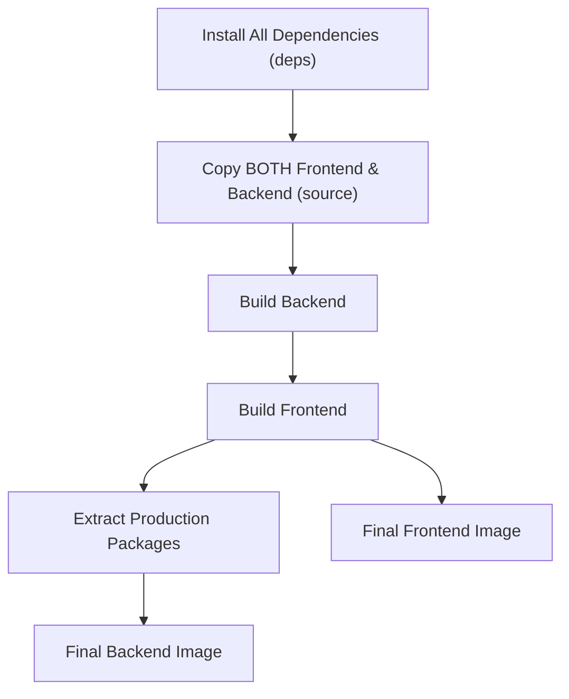
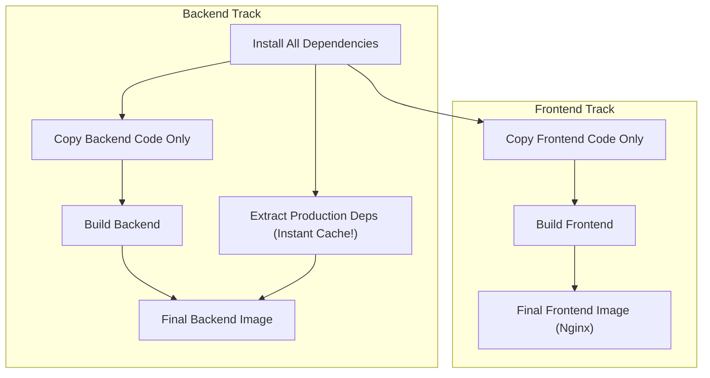

# How to Make Docker Builds Faster

> **Reading time:** ~5 to 7 minutes  
> **Target:** Clear, simple explanation for humans with no complex jargon.

---

## 1. The Executive Summary

Right now, our Docker build takes longer than it should because:
1. **Frontend and Backend are tied together:** If you change one word on a website button, Docker throws away its memory and rebuilds the backend server too.
2. **Steps run in a single line instead of side-by-side:** Docker waits for the backend to finish compiling before it even starts the frontend.
3. **Repeated package work:** Docker re-checks dependencies even when you did not add or remove any packages.

Experienced Docker engineers fix this using **parallel tracks** and **smart caching**. 

With these changes, **rebuilding after a small code edit drops from ~1–2 minutes to under 10 seconds**, while keeping the exact same app behavior.

---

## 2. The Kitchen Analogy

Imagine a restaurant kitchen preparing two orders:
* Order A: A Chocolate Cake (**Frontend**)
* Order B: A Steak (**Backend**)

### How our kitchen works today:
One cook handles both orders sequentially:
1. They chop all ingredients for both dishes together on the same table.
2. If you ask for a little more salt on the steak, the cook throws away **both** the steak and the finished cake, and starts everything over from step one.
3. The cook bakes the cake first, and only when the cake is done do they start cooking the steak.

### How professional kitchens work:
Two cooks work at two different stations:
1. Cook 1 bakes the cake.
2. Cook 2 grills the steak at the exact same time.
3. If someone asks for salt on the steak, Cook 1 doesn't care—the cake is already done and stays on the counter. Only the steak is touched.

---

## 3. What Is Slow Today & How to Fix It

Here are the 4 main problems in our current [Dockerfile](file:///home/jcarrasco21/Projects/Memsystems/Dockerfile) and how experienced developers solve each one:

### Problem 1: The "Domino Effect" (Coupled Cache)
* **What happens now:**  
  Lines 26–27 copy both `frontend` and `backend` folders together in one step:
  ```dockerfile
  COPY frontend ./frontend
  COPY backend ./backend
  ```
  Then line 40–41 builds both:
  ```dockerfile
  RUN cd backend && pnpm run build
  RUN cd frontend && pnpm run build
  ```
  If you edit **one line** in the frontend, Docker forgets its saved work for the backend. It forces both to rebuild from scratch every time.
* **The fix:**  
  Split the build into two separate stages:
  - A `backend-build` stage that **only copies the backend folder**.
  - A `frontend-build` stage that **only copies the frontend folder**.
  Now, frontend edits never touch backend steps, and backend edits never touch frontend steps.

---

### Problem 2: Sequential Building (No Parallel Work)
* **What happens now:**  
  Our Dockerfile runs:
  1. Backend build.
  2. Waits for backend to finish.
  3. Frontend build.  
  Your computer has multiple CPU cores sitting idle while one waits for the other.
* **The fix:**  
  Modern Docker (BuildKit) can build separate stages **at the exact same time**.  
  When backend and frontend are in separate stages, Docker starts both immediately. Your build time for this step is cut in half.

---

### Problem 3: Unnecessary Dependency Re-packaging
* **What happens now:**  
  Line 46 has this step:
  ```dockerfile
  FROM build AS backend-prod-deps
  ```
  This step prepares the final packages needed to run the backend in production.  
  Because it comes *after* `build`, Docker re-runs this step whenever your code changes, even if you never changed any package in `package.json`!
* **The fix:**  
  Make `backend-prod-deps` depend directly on `deps` (the stage that installed the packages), **not** on `build`.  
  Unless you install or remove a package, this step takes **0.0 seconds** because Docker reuses the saved result.

---

### Problem 4: Missing Compiler Memory (Turbo & TypeScript Cache)
* **What happens now:**  
  Our project uses **Turborepo** and **TypeScript**. Both have built-in memory: once they compile a file, they remember the result so the next build only compiles what changed.  
  Inside Docker, that memory folder (`.turbo` and TypeScript build info) is reset to empty on every build.
* **The fix:**  
  Use Docker "cache mounts". This is a single flag that tells Docker:  
  *"Save this folder between builds so the compiler remembers its past work."*  
  Example:
  ```dockerfile
  RUN --mount=type=cache,target=/app/.turbo \
      pnpm run build
  ```

---

## 4. Visual Comparison

### Current Flow (Slow & Fragile)

*Notice: Everything is one single line. Any small edit at the top causes every step below it to restart.*

### Optimized Flow (Fast & Independent)

*Notice: The tracks are separate and run at the same time. Editing frontend never touches the backend track.*

---

## 5. Expected Speed Improvements

| Scenario | Current Build Time | Optimized Build Time | Improvement |
| :--- | :--- | :--- | :--- |
| **First Build (Cold / Clean)** | ~2 min 15 sec | ~1 min 10 sec | **~2x faster** (Builds frontend & backend in parallel) |
| **Frontend Code Change Only** | ~1 min 30 sec | ~8 to 12 sec | **~8x to 10x faster** (Backend is 100% skipped) |
| **Backend Code Change Only** | ~1 min 30 sec | ~6 to 10 sec | **~9x to 12x faster** (Frontend is 100% skipped) |
| **No Code Changes (Just Re-running)** | ~15 sec | ~1 sec | **Instant** (All cached) |

---

## 6. Recommended Action Plan (When Ready to Implement)

To achieve this without breaking anything:

1. **Split the `build` stage in `Dockerfile` into two stages:**
   - `backend-build` (copies only `backend/`, runs `pnpm --filter=backend build`)
   - `frontend-build` (copies only `frontend/`, runs `pnpm --filter=frontend build`)
2. **Move `backend-prod-deps` to start `FROM deps`** instead of `FROM build`.
3. **Mount Turborepo cache (`/app/.turbo`)** during build commands.
4. **Keep development targets unchanged:** The dev container will continue working with live reload exactly as it does today.
